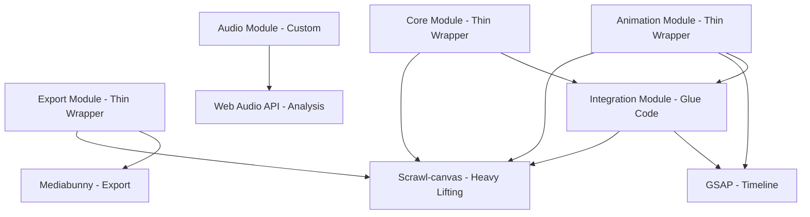

# Design Document: Motion Graphics Engine Core

## Overview

The Motion Graphics Engine Core is a **thin orchestration layer** that integrates three powerful libraries for programmatic video generation:

1. **Scrawl-canvas**: Handles all rendering, scene graph management, effects, particles, text layout, and canvas animation
2. **GSAP**: Provides advanced timeline sequencing and animation choreography  
3. **Mediabunny**: Handles video I/O (muxing encoded frames into video files, demuxing video files, WebCodecs wrapper)

Rather than reimplementing these capabilities, the Engine provides a motion-graphics-focused API that orchestrates their integration.

### Core Design Philosophy

**Orchestration, Not Reimplementation**: The engine orchestrates existing libraries rather than rebuilding their features.

**Scrawl-canvas** (Rendering & Scene Management):
- **Scene Graph**: Canvas, Cell, Group, entities (Block, Wheel, Shape, Line, Bezier, Picture, Label, Emitter, Net, Tracer, etc.)
- **40+ Filters**: blur, gaussian-blur, color adjustments, displacement, convolution, OKLCH color space filters
- **Particle Physics**: Complete 2D physics engine with Emitter, Net, Tracer entities
- **Advanced Colors**: OKLCH, Display-P3, wide-gamut, color interpolation with easing
- **Text Layout**: Label and EnhancedLabel with path-following, RTL, accessibility
- **Animation**: Ticker, Tween, Action objects with easing functions
- **Asset Management**: Image, video, sprite, SVG loading with caching
- **DOM Integration**: Stack and Element artefacts for canvas + DOM synchronization
- **Accessibility**: WCAG compliance, keyboard navigation, screen reader support
- **User Interaction**: Hit testing, drag-and-drop, hover, click, touch events

**Mediabunny** (Video I/O):
- **Video/Audio Muxing**: Writes encoded video/audio streams into container formats (MP4, WebM, MKV, AVI, MOV)
- **WebCodecs Wrapper**: Provides cleaner API over browser WebCodecs for encoding/decoding
- **Demuxing**: Reads video/audio files, extracts streams, metadata (duration, frame rate, codec info), and frames
- **Format Conversion**: Converts between different container formats
- **Custom Codecs**: Adds support for codecs not natively supported (FLAC, MP3, AAC via WASM)
- **Streaming Muxing**: Supports streaming muxing (write-as-you-encode) and chunked writing

**GSAP** (Timeline Choreography):
- **Advanced Sequencing**: Timeline with labels, callbacks, nested timelines
- **Complex Animations**: Stagger animations, advanced easing functions
- **Timeline Control**: Play, pause, seek, reverse, repeat

**Our Focus**: Build a simple, progressive API for motion graphics, orchestrate GSAP timeline with Scrawl-canvas rendering, integrate Mediabunny for video export, and provide audio reactivity.

The engine follows a **deep modules architecture** where each module presents a simple, focused interface while handling significant complexity internally (including Scrawl-canvas integration). This approach minimizes cognitive load by limiting the number of top-level concepts developers must understand.

The API design follows **progressive complexity disclosure**, offering three tiers:
- **Beginner**: Simple defaults for 80% of use cases
- **Intermediate**: Common customization options via optional parameters
- **Advanced**: Full control through specialized methods and direct Scrawl-canvas access

### Technology Stack

- **Scrawl-canvas**: Canvas rendering, scene graph, filters, particles, text, animation, assets, DOM integration, accessibility
  - Docs: https://scrawl-v8.rikweb.org.uk/docs/reference/index.html
  - LLM Summary: https://github.com/KaliedaRik/Scrawl-canvas/blob/v8/LLM-summary-for-scrawl-canvas.md
- **GSAP**: Timeline sequencing, animation choreography, advanced easing functions
  - Docs: https://gsap.com/docs/
- **Mediabunny**: Video/audio I/O (reading, writing, converting), encoding/decoding, metadata extraction
  - Docs: https://mediabunny.dev/
  - LLM Docs: https://mediabunny.dev/llms.txt
- **Web Audio API**: Audio reactivity only (FFT analysis for frequency bands and amplitude)

### Performance Targets

- 60fps rendering for real-time preview (handled by Scrawl-canvas)
- Efficient memory management with asset caching (handled by Scrawl-canvas)
- Frame-accurate video export with configurable quality settings (Mediabunny + Scrawl-canvas)

## Architecture

### Module Structure

The engine is organized into **5 top-level modules** (thin wrapper layer), adhering to the 7±2 cognitive limit:

1. **Core Module**: Composition API (wraps Canvas + Cell + Group), Layer API (wraps entities), Timeline control (GSAP + Ticker sync)
2. **Animation Module**: Keyframe system (wraps Tween + GSAP), Expression evaluation
3. **Export Module**: Video export (Mediabunny + Scrawl-canvas rendering), Frame export
4. **Audio Module**: Audio reactivity (Web Audio API + FFT analysis), Audio layers
5. **Integration Module**: GSAP-Scrawl-canvas synchronization, Serialization (wraps packet system)

**Scrawl-canvas provides the heavy lifting** (not reimplemented):
- Scene graph (Canvas, Cell, Group, entities)
- Rendering pipeline (display cycle: clear, compile, show)
- 40+ filters (blur, color, displacement, convolution, OKLCH)
- Particle physics (Emitter, Net, Tracer, Force, Spring, ParticleWorld)
- Text layout (Label, EnhancedLabel)
- Animation (Ticker, Tween, Action, delta)
- Asset management (images, video, sprites, SVG)
- Color system (OKLCH, Display-P3, interpolation)
- DOM integration (Stack, Element artefacts)
- Accessibility (WCAG, keyboard, screen reader)
- User interaction (hit testing, drag-drop, events)

### Module Dependency Graph



**Dependency Constraints:**
- Maximum 3 direct dependencies per module
- No circular dependencies
- Scrawl-canvas is the foundation for all rendering and scene management
- GSAP is the primary timeline controller
- Mediabunny handles video encoding
- Web Audio API provides audio analysis

### Deep Modules Design

Each module follows the deep module pattern:

**Simple Interface (≤10 public methods)** → **Complex Implementation (wraps Scrawl-canvas + integration logic)**

Example: The Core Module exposes ~8 methods (`createComposition`, `addLayer`, `removeLayer`, `play`, `pause`, `seek`, `serialize`, `deserialize`) but internally wraps Scrawl-canvas Canvas artefacts, Cells, Groups, entities, and integrates GSAP timeline with Scrawl-canvas Ticker.

### Progressive Complexity Disclosure

**Beginner API (Simple Defaults):**
```typescript
const comp = engine.createComposition({ width: 1920, height: 1080 });
const layer = comp.addImageLayer('image.png');
layer.animate({ x: 100, y: 200 }, { duration: 2 });
comp.play();
```

**Intermediate API (Common Customization):**
```typescript
const comp = engine.createComposition({ 
  width: 1920, 
  height: 1080, 
  duration: 10,
  frameRate: 30 
});
const layer = comp.addImageLayer('image.png', { 
  scaleMode: 'fit',
  opacity: 0.8 
});
layer.animate({ x: 100, y: 200 }, { 
  duration: 2, 
  easing: 'power2.out',
  delay: 0.5 
});
```

**Advanced API (Full Control + Direct Scrawl-canvas Access):**
```typescript
const comp = engine.createComposition({ 
  width: 1920, 
  height: 1080, 
  duration: 10,
  frameRate: 30,
  backgroundColor: '#000000'
});
const layer = comp.addImageLayer('image.png', { 
  scaleMode: 'fit',
  transform: {
    position: { x: 960, y: 540 },
    anchor: { x: 0.5, y: 0.5 },
    scale: { x: 1.5, y: 1.5 },
    rotation: 45
  }
});

// Direct Scrawl-canvas entity access for advanced features
const scrawlEntity = layer._scrawlEntity;
scrawlEntity.set({
  lockTo: 'pivot',
  pivot: someOtherLayer._scrawlEntity
});

layer.addKeyframe('position.x', 0, 0, { easing: 'power2.inOut' });
layer.addKeyframe('position.x', 2, 1920, { easing: 'power2.inOut' });
layer.addEffect('blur', { radius: 10 });
layer.addMask('ellipse', { width: 500, height: 500, feather: 20 });
```

## Components and Interfaces

### Core Module

**Responsibilities:**
- Wrap Scrawl-canvas Canvas artefact + base Cell as Composition
- Wrap Scrawl-canvas entities as Layers
- Integrate GSAP timeline with Scrawl-canvas Ticker
- Provide simple API for motion graphics use case

**Public Interface (8 methods):**

```typescript
interface CoreModule {
  createComposition(config: CompositionConfig): Composition;
  
  // Composition methods (via Composition object)
  addLayer(type: LayerType, source?: string, config?: LayerConfig): Layer;
  removeLayer(layer: Layer): void;
  reorderLayer(layer: Layer, newIndex: number): void;
  
  play(): void;
  pause(): void;
  seek(time: number): void;
  
  serialize(): string;
  deserialize(json: string): Composition;
}

interface CompositionConfig {
  width: number;
  height: number;
  duration?: number;        // default: 10 seconds
  frameRate?: number;       // default: 30 fps
  backgroundColor?: string; // default: transparent
}

interface LayerConfig {
  transform?: TransformConfig;
  opacity?: number;
  visible?: boolean;
  locked?: boolean;
  parent?: Layer;
  // Layer-specific configs (scaleMode for images, etc.)
  [key: string]: any;
}
```

**Internal Complexity (Wrapping Scrawl-canvas):**
- Create Scrawl-canvas Canvas artefact and base Cell for Composition
- Map Layer types to Scrawl-canvas entity factories (Block, Wheel, Picture, Label, Emitter, etc.)
- Use Scrawl-canvas Groups for z-ordering and batch operations
- Use Scrawl-canvas pivot/mimic for parent-child relationships
- Integrate GSAP timeline with Scrawl-canvas RenderAnimation
- Wrap Scrawl-canvas packet system for serialization
- Validate composition and layer properties before passing to Scrawl-canvas

### Animation Module

**Responsibilities:**
- Integrate GSAP timeline for animation choreography
- Read interpolated values from GSAP tweens
- Update Scrawl-canvas entity properties directly
- Provide expression evaluation system
- Synchronize GSAP timeline with Scrawl-canvas rendering

**Public Interface (6 methods):**

```typescript
interface AnimationModule {
  addKeyframe(property: string, time: number, value: any, config?: KeyframeConfig): Keyframe;
  removeKeyframe(keyframe: Keyframe): void;
  updateKeyframe(keyframe: Keyframe, updates: Partial<KeyframeConfig>): void;
  
  animate(properties: object, config: AnimationConfig): Animation;
  
  setExpression(property: string, expression: string): void;
  removeExpression(property: string): void;
}

interface KeyframeConfig {
  easing?: string | EasingFunction;
  hold?: boolean; // step function, no interpolation (uses GSAP duration:0)
}

interface AnimationConfig {
  duration: number;
  delay?: number;
  easing?: string;
  repeat?: number;
  yoyo?: boolean;
  onComplete?: () => void;
}
```

**Internal Complexity (GSAP Integration):**
- Create GSAP tweens for property interpolation
- On each frame, read interpolated values from GSAP tweens
- Update Scrawl-canvas entity properties via entity.set()
- Do NOT create Scrawl-canvas Tween objects (avoids dual animation systems)
- Synchronize GSAP timeline.time() with Scrawl-canvas rendering
- Expression parser and evaluator with context (time, frame, layer properties, audio data)
- Update expression-driven properties before each Scrawl-canvas display cycle
- Handle hold keyframes using GSAP duration:0 tweens

### Export Module

**Responsibilities:**
- Frame-by-frame video rendering using Scrawl-canvas
- Video encoding via Mediabunny/WebCodecs
- Frame export using canvas data
- Export progress tracking

**Public Interface (4 methods):**

```typescript
interface ExportModule {
  exportVideo(composition: Composition, config: VideoExportConfig): Promise<Blob>;
  exportFrame(composition: Composition, time: number, config: FrameExportConfig): Promise<Blob>;
  exportFrameSequence(composition: Composition, config: SequenceExportConfig): Promise<Blob[]>;
  
  cancelExport(): void;
}

interface VideoExportConfig {
  format: 'mp4' | 'webm';
  bitrate?: number;
  quality?: number;
  frameRate?: number; // can differ from composition frameRate
  includeAudio?: boolean;
  onProgress?: (progress: number) => void;
}

interface FrameExportConfig {
  format: 'png' | 'jpg' | 'webp';
  quality?: number; // for lossy formats
  outputType?: 'blob' | 'arraybuffer' | 'dataurl';
}

interface SequenceExportConfig extends FrameExportConfig {
  startTime: number;
  endTime: number;
  frameStep?: number; // export every Nth frame
  filenamePadding?: number; // zero-padding for frame numbers
}
```

**Internal Complexity (Integrating Mediabunny + Scrawl-canvas):**
- Seek GSAP timeline and sync Scrawl-canvas Ticker for each frame
- Trigger Scrawl-canvas display cycle (clear, compile, show) for frame rendering
- Capture canvas data using canvas.toBlob() or canvas.toDataURL()
- Send frame data to Mediabunny for WebCodecs encoding
- Audio track extraction and encoding via Mediabunny
- Progress calculation and event emission
- Error handling for encoding failures
- Memory management for frame buffers

### Audio Module

**Responsibilities:**
- Audio layer management (uses Mediabunny for all audio file operations)
- FFT analysis using Web Audio API (for audio reactivity only)
- Frequency band extraction (bass, mid, treble)
- Amplitude calculation
- Provide audio data to expression system

**Public Interface (6 methods):**

```typescript
interface AudioModule {
  addAudioLayer(source: string, config?: AudioLayerConfig): AudioLayer;
  removeAudioLayer(layer: AudioLayer): void;
  
  setVolume(layer: AudioLayer, volume: number): void;
  setFade(layer: AudioLayer, fadeIn: number, fadeOut: number): void;
  
  getFrequencyData(bands?: number): Float32Array;
  getAmplitude(): number;
}

interface AudioLayerConfig {
  volume?: number;
  inPoint?: number;
  outPoint?: number;
  fadeIn?: number;
  fadeOut?: number;
}
```

**Internal Complexity (Mediabunny + Web Audio API):**
- **Mediabunny handles**: Audio file loading, demuxing, decoding, metadata extraction (duration, sample rate, codec info)
- **Web Audio API handles**: Audio playback and FFT analysis via AnalyserNode (for audio reactivity only)
- **Connection flow**: Mediabunny demuxes → decoded audio data → Web Audio API AudioContext → AnalyserNode for FFT
- Timeline synchronization using GSAP timeline position
- FFT computation with configurable size
- Frequency band aggregation (bass: 20-250Hz, mid: 250-4000Hz, treble: 4000-20000Hz)
- Amplitude normalization (0.0 to 1.0)
- Audio trimming (in-point, out-point) via time offset calculations
- Volume and fade curve application
- Provide audio data to expression context

### Integration Module

**Responsibilities:**
- Synchronize GSAP timeline with Scrawl-canvas Ticker
- Wrap Scrawl-canvas packet system for serialization
- Provide unified API surface for motion graphics use case

**Public Interface (Internal - used by other modules):**

```typescript
interface IntegrationModule {
  // GSAP-Scrawl sync
  syncTimelineToTicker(gsapTimeline: GSAPTimeline, scrawlTicker: Ticker): void;
  syncTickerToTimeline(scrawlTicker: Ticker, gsapTimeline: GSAPTimeline): void;
  
  // Serialization
  serializeComposition(composition: Composition): string;
  deserializeComposition(json: string): Composition;
  
  // Entity mapping
  mapLayerTypeToEntityFactory(layerType: LayerType): EntityFactory;
  mapEntityToLayer(entity: Entity): Layer;
}
```

**Internal Complexity (Glue Code):**
- Bidirectional sync between GSAP timeline.time() and Scrawl-canvas Ticker progress
- Wrap Scrawl-canvas saveAsPacket() and importPacket() for serialization
- Add composition-level metadata (duration, frameRate, GSAP timeline state)
- Map Layer types to Scrawl-canvas entity factories
- Maintain Layer-Entity bidirectional mapping
- Handle Scrawl-canvas event listeners for timeline events

## Data Models

### Composition (Wraps Scrawl-canvas Canvas + Cell)

```typescript
interface Composition {
  id: string;
  width: number;
  height: number;
  duration: number;
  frameRate: number;
  backgroundColor: string;
  
  // Internal Scrawl-canvas objects
  _scrawlCanvas: Canvas;
  _scrawlBaseCell: Cell;
  _scrawlMainGroup: Group;
  
  // GSAP timeline
  _gsapTimeline: GSAPTimeline;
  
  layers: Layer[];
  
  // Methods handled by Core Module
  addLayer(type: LayerType, source?: string, config?: LayerConfig): Layer;
  removeLayer(layer: Layer): void;
  reorderLayer(layer: Layer, newIndex: number): void;
  
  play(): void;
  pause(): void;
  seek(time: number): void;
  
  serialize(): string;
}
```

### Layer (Wraps Scrawl-canvas Entity)

```typescript
interface Layer {
  id: string;
  type: LayerType;
  name: string;
  
  // Internal Scrawl-canvas entity
  _scrawlEntity: Entity; // Block, Wheel, Picture, Label, Emitter, etc.
  
  // Hierarchy (uses Scrawl-canvas pivot/mimic)
  parent: Layer | null;
  children: Layer[];
  zIndex: number;
  
  // Transform (maps to Scrawl-canvas entity attributes)
  transform: Transform;
  
  // Visibility (maps to Scrawl-canvas entity visibility)
  visible: boolean;
  locked: boolean;
  opacity: number; // maps to globalAlpha
  
  // Effects and Masks (uses Scrawl-canvas Filters)
  effects: Effect[]; // wraps Scrawl-canvas Filter objects
  masks: Mask[]; // uses Scrawl-canvas entity clipping
  blendMode: BlendMode; // maps to globalCompositeOperation
  
  // Keyframes (wraps Scrawl-canvas Tween objects)
  keyframes: Map<string, Keyframe[]>;
  expressions: Map<string, string>;
  
  // Layer-specific data
  source?: string; // for image, video, audio, SVG layers
  content?: any;   // for shape, text, particle layers
}

type LayerType = 'image' | 'video' | 'audio' | 'svg' | 'shape' | 'text' 
               | 'particle' | 'precomp';
```

### Transform (Maps to Scrawl-canvas Entity Positioning)

```typescript
interface Transform {
  // Maps to Scrawl-canvas start/offset attributes
  position: { x: number; y: number };
  
  // Maps to Scrawl-canvas roll attribute
  rotation: number; // degrees
  
  // Maps to Scrawl-canvas scale attribute
  scale: { x: number; y: number }; // percentages (1.0 = 100%)
  
  // Maps to Scrawl-canvas handle attribute
  anchor: { x: number; y: number }; // anchor point in pixels
  
  // 3D transforms (uses Scrawl-canvas Canvas artefact pitch, yaw, roll)
  rotationX?: number;
  rotationY?: number;
  rotationZ?: number;
}
```

### Keyframe (Uses GSAP Tween)

```typescript
interface Keyframe {
  id: string;
  property: string; // e.g., 'position.x', 'opacity', 'effects.0.radius'
  time: number;     // seconds
  value: any;
  easing: string | EasingFunction;
  hold: boolean;    // step function (uses GSAP duration:0 instead of interpolation)
  
  // Internal GSAP tween reference
  _gsapTween: GSAPTween;
}

type EasingFunction = (t: number) => number;
```

### Effect (Wraps Scrawl-canvas Filter)

```typescript
interface Effect {
  id: string;
  type: EffectType;
  enabled: boolean;
  parameters: Map<string, any>;
  
  // Internal Scrawl-canvas Filter object
  _scrawlFilter: Filter;
}

type EffectType = 'blur' | 'gaussian-blur' | 'brightness' | 'contrast' | 'saturation' 
                | 'hue-rotate' | 'grayscale' | 'sepia' | 'invert' | 'threshold'
                | 'displace' | 'swirl' | 'glitch' | 'pixelate' | 'newsprint'
                | 'reduce-palette' | 'emboss' | 'sharpen' | 'edge-detect'
                | 'zoom-blur' | 'tiles' | 'corrode' | 'matrix' | 'custom';
```

### Mask (Uses Scrawl-canvas Entity Clipping)

```typescript
interface Mask {
  id: string;
  shape: MaskShape;
  mode: 'add' | 'subtract' | 'intersect' | 'difference';
  feather: number;
  opacity: number;
  
  // Internal Scrawl-canvas entity used as clip path
  _scrawlMaskEntity: Entity;
  
  path: Path; // shape-specific path data
}

type MaskShape = 'rectangle' | 'ellipse' | 'polygon' | 'path';

interface Path {
  // Shape-specific properties
  [key: string]: any;
}
```

### Timeline (Integrates GSAP + Scrawl-canvas RenderAnimation)

```typescript
interface Timeline {
  currentTime: number;
  duration: number;
  playing: boolean;
  loop: boolean;
  reverse: boolean;
  
  // GSAP timeline (primary controller and master clock)
  gsapTimeline: GSAPTimeline;
  
  // Scrawl-canvas RenderAnimation (display cycle trigger)
  scrawlRenderAnimation: RenderAnimation;
  
  // Events
  on(event: TimelineEvent, callback: () => void): void;
  off(event: TimelineEvent, callback: () => void): void;
}

type TimelineEvent = 'play' | 'pause' | 'seek' | 'complete' | 'loop';
```

### Particle System (Uses Scrawl-canvas Emitter/Net/Tracer)

```typescript
interface ParticleSystem {
  id: string;
  type: 'emitter' | 'net' | 'tracer';
  
  // Internal Scrawl-canvas particle entity
  _scrawlParticleEntity: Emitter | Net | Tracer;
  
  // Configuration (maps to Scrawl-canvas particle config)
  emitter?: {
    position: { x: number; y: number };
    rate: number; // particles per second
  };
  
  particleConfig?: {
    lifetime: { min: number; max: number };
    size: { min: number; max: number };
    color: { start: string; end: string };
    velocity: { x: { min: number; max: number }; y: { min: number; max: number } };
    acceleration: { x: number; y: number };
    texture?: string; // image source or shape type
  };
}
```

### Precomposition Layer (Uses Scrawl-canvas Cell)

```typescript
interface PrecompLayer extends Layer {
  type: 'precomp';
  
  // Internal Scrawl-canvas Cell (off-screen canvas)
  _scrawlCell: Cell;
  
  // Picture entity that renders the Cell
  _scrawlPictureEntity: Picture;
  
  composition: Composition;
  timeRemap?: {
    enabled: boolean;
    keyframes: Keyframe[];
  };
}
```

### Serialization Format (Wraps Scrawl-canvas Packet System)

```typescript
interface SerializedComposition {
  version: string; // semantic version
  composition: {
    id: string;
    width: number;
    height: number;
    duration: number;
    frameRate: number;
    backgroundColor: string;
  };
  
  // Scrawl-canvas packet data
  scrawlPacket: any;
  
  // GSAP timeline state
  gsapTimelineState: {
    labels: Record<string, number>;
    tweens: any[];
  };
  
  // Additional metadata
  layers: SerializedLayer[];
  assets: SerializedAsset[];
}

interface SerializedLayer {
  id: string;
  type: LayerType;
  name: string;
  parentId: string | null;
  zIndex: number;
  
  // Scrawl-canvas entity name (for packet lookup)
  scrawlEntityName: string;
  
  // Additional layer metadata
  expressions: { property: string; expression: string }[];
  source?: string;
  content?: any;
}

interface SerializedAsset {
  id: string;
  source: string;
  type: AssetType;
}

type AssetType = 'image' | 'video' | 'audio' | 'svg';
```

## Correctness Properties

*A property is a characteristic or behavior that should hold true across all valid executions of a system-essentially, a formal statement about what the system should do. Properties serve as the bridge between human-readable specifications and machine-verifiable correctness guarantees.*

### Property 1: Composition Validation Consistency

*For any* composition configuration with invalid parameters (negative dimensions, invalid frame rate, etc.), the Engine SHALL reject the configuration and return a descriptive validation error before creating the composition.

**Validates: Requirements 1.2, 1.3, 1.4**

### Property 2: Parent Transform Propagation (via Scrawl-canvas pivot/mimic)

*For any* layer with a parent layer, when the parent's transform properties change, Scrawl-canvas SHALL propagate the transformation to child layers via pivot/mimic positioning.

**Validates: Requirements 2.3**

### Property 3: Layer Removal Cascade

*For any* layer with child layers, when the layer is removed from the composition, all descendant layers SHALL also be removed.

**Validates: Requirements 2.8**

### Property 4: Image Loading Round Trip (via Scrawl-canvas Picture entity)

*For any* supported image format, loading the image via Scrawl-canvas then rendering it SHALL produce a visual output that matches the original image content.

**Validates: Requirements 3.1, 3.2**

### Property 5: Video Timeline Synchronization

*For any* video layer and timeline position, seeking the GSAP timeline to time T SHALL result in the video layer displaying the frame at time T (adjusted for in-point and time remapping).

**Validates: Requirements 4.3, 4.4, 4.5, 4.7**

### Property 6: GSAP-Scrawl Timeline Synchronization

*For any* timeline position change (play, pause, seek), the GSAP timeline position SHALL control Scrawl-canvas rendering within one frame.

**Validates: Requirements 11.1, 11.2, 11.3, 12.4**

### Property 7: Keyframe Interpolation Correctness (via GSAP Tween)

*For any* property with two keyframes at times T1 and T2 with values V1 and V2, GSAP Tween SHALL interpolate the property value at time T (where T1 < T < T2) based on the easing function, and the Engine SHALL update Scrawl-canvas entity properties with the interpolated values.

**Validates: Requirements 10.2, 10.3, 10.4**

### Property 8: Effect Stack Sequential Processing (via Scrawl-canvas Filters)

*For any* layer with multiple effects, Scrawl-canvas SHALL apply filters sequentially in the order they appear in the effect stack.

**Validates: Requirements 13.8**

### Property 9: Serialization Round Trip (via Scrawl-canvas Packet System)

*For any* valid composition, serializing the composition using Scrawl-canvas packets then deserializing it SHALL produce an equivalent composition with all properties preserved.

**Validates: Requirements 23.6**

### Property 10: Video Export Frame Accuracy

*For any* composition exported to video, each frame in the output video SHALL correspond to the correct time position in the GSAP timeline, with Scrawl-canvas rendering the correct visual state and Mediabunny media seeks completed before frame capture.

**Validates: Requirements 21.1, 28.7, 28.14**

### Property 11: Audio Frequency Analysis Normalization

*For any* audio layer with frequency analysis enabled, the frequency band values (bass, mid, treble) and amplitude SHALL be normalized to the range [0.0, 1.0].

**Validates: Requirements 25.2, 25.3**

### Property 12: Expression Evaluation Context

*For any* property with an expression, the expression SHALL have access to the current time, frame number, layer properties, and audio data, and SHALL evaluate to produce the property value for that frame.

**Validates: Requirements 18.2, 18.4**

## Error Handling

### Error Categories

The Engine defines four categories of errors:

1. **Validation Errors**: Invalid input parameters or configuration
2. **Resource Errors**: Failed asset loading, unsupported formats, missing files
3. **Runtime Errors**: Errors during rendering, animation, or export
4. **Capability Errors**: Missing browser APIs or unsupported features

### Error Object Structure

```typescript
interface EngineError {
  code: string;           // Error code (e.g., 'INVALID_DIMENSIONS', 'ASSET_LOAD_FAILED')
  message: string;        // Human-readable error message
  category: ErrorCategory;
  context?: {             // Context information for debugging
    filePath?: string;
    layerName?: string;
    propertyName?: string;
    value?: any;
  };
  suggestion?: string;    // Recovery suggestion
  originalError?: Error;  // Original error if wrapped
}

type ErrorCategory = 'validation' | 'resource' | 'runtime' | 'capability';
```

## Testing Strategy

### Dual Testing Approach

The Engine employs both **unit testing** and **property-based testing**:

- **Unit Tests**: Verify specific examples, edge cases, error conditions, and integration points
- **Property Tests**: Verify universal properties across all inputs through randomized testing

### Unit Testing

**Focus Areas**:
- Specific examples demonstrating correct behavior
- Edge cases (empty inputs, boundary values, extreme parameters)
- Error conditions and validation
- Integration between modules (GSAP-Scrawl sync, Mediabunny export)
- Scrawl-canvas wrapper behavior

**Example Unit Tests**:
- Creating a composition creates Scrawl-canvas Canvas artefact and base Cell
- Adding a layer creates appropriate Scrawl-canvas entity (Picture, Label, Emitter, etc.)
- GSAP timeline.seek() syncs with Scrawl-canvas Ticker progress
- Removing a layer with children removes all descendants
- Invalid frame rate (0, negative, >120) throws validation error
- Circular precomposition reference detection

### Property-Based Testing

**Framework**: fast-check (JavaScript/TypeScript property-based testing library)

**Configuration**:
- Minimum 100 iterations per property test
- Each test tagged with reference to design document property
- Tag format: `Feature: motion-graphics-engine-core, Property {number}: {property_text}`

**Example Property Tests**:
- Property 1: Composition Validation Consistency
- Property 6: GSAP-Scrawl Timeline Synchronization
- Property 7: Keyframe Interpolation Correctness (via Scrawl-canvas Tween)
- Property 9: Serialization Round Trip (via Scrawl-canvas Packet System)


## Three-Library Synchronization Architecture

### The Synchronization Challenge

The engine integrates three powerful libraries, each with their own responsibilities:

1. **GSAP**: Timeline control (master clock)
2. **Scrawl-canvas**: Rendering (display cycle)
3. **Mediabunny**: Media playback (video/audio)

All three must stay perfectly synchronized for correct playback and export.

### Master Clock: GSAP Timeline

**GSAP timeline is the single source of truth for time position.**

- GSAP timeline.time() represents the current composition time in seconds
- All other systems (Scrawl-canvas rendering, Mediabunny media) sync to GSAP timeline
- GSAP provides timeline control: play(), pause(), seek(), reverse(), repeat()
- GSAP handles animation choreography: labels, callbacks, nested timelines, stagger
- GSAP handles property interpolation: tweens calculate values at each time position

### Animation Architecture Decision

**GSAP handles interpolation, Scrawl-canvas handles rendering:**

1. **GSAP tweens** interpolate property values over time
2. **On each frame**, read interpolated values from GSAP tweens
3. **Update Scrawl-canvas** entity properties via `entity.set()`
4. **Scrawl-canvas renders** entities with updated properties

**Why not use Scrawl-canvas Tweens?**
- Scrawl-canvas Tweens run on their own Ticker system
- This creates two competing animation systems with potential conflicts
- Simpler to have GSAP as single source of truth for interpolation
- Scrawl-canvas focuses purely on rendering (its strength)
- Avoids synchronization complexity between two animation systems

### Synchronization Flow

```
GSAP Timeline (Master Clock)
    ↓ timeline.time()
    ├─→ GSAP Tweens (Interpolation)
    │   └─→ Read interpolated values
    │       └─→ Update Scrawl-canvas entities via entity.set()
    │
    ├─→ Scrawl-canvas RenderAnimation (Rendering)
    │   └─→ Display cycle: clear → compile → show
    │
    └─→ Mediabunny Media (Playback)
        ├─→ video.currentTime = timeline.time()
        └─→ audio.currentTime = timeline.time()
```

### Real-Time Playback Synchronization

**When user calls `composition.play()`:**

1. **GSAP timeline.play()** starts the master clock
2. **Scrawl-canvas RenderAnimation** starts via `makeRender()` with hook function
3. **Hook function** (called every frame):
   - Read GSAP `timeline.time()`
   - Read interpolated values from all active GSAP tweens
   - Update Scrawl-canvas entity properties via `entity.set()`
   - Update Mediabunny video/audio `currentTime` to match
   - Trigger Scrawl-canvas display cycle (clear, compile, show)
4. **requestAnimationFrame** loop continues until timeline completes or pauses

**When user calls `composition.pause()`:**

1. **GSAP timeline.pause()** stops the master clock
2. **Scrawl-canvas RenderAnimation** stops (no more display cycles)
3. **Mediabunny media** pauses (video.pause(), audio.pause())

**When user calls `composition.seek(time)`:**

1. **GSAP timeline.seek(time)** updates master clock position
2. **GSAP tweens** calculate interpolated values at new time
3. **Scrawl-canvas entities** updated via entity.set() with new values
4. **Mediabunny media** seeks (video.currentTime = time, audio.currentTime = time)
5. **Scrawl-canvas display cycle** executes once to render frame at new time
6. **Result**: Composition displays correct frame at specified time

### Frame-by-Frame Export Synchronization

**Export is different from real-time playback** - we need frame-accurate rendering, not real-time speed.

**When user calls `composition.exportVideo()`:**

```typescript
async function exportVideo(composition: Composition, config: VideoExportConfig) {
  const frameCount = Math.ceil(composition.duration * config.frameRate);
  const frameDuration = 1 / config.frameRate;
  
  // Initialize Mediabunny encoder
  const encoder = await Mediabunny.createEncoder(config);
  
  for (let frame = 0; frame < frameCount; frame++) {
    const time = frame * frameDuration;
    
    // 1. Seek GSAP timeline to exact frame time
    composition._gsapTimeline.seek(time, false); // false = suppress events
    
    // 2. Read interpolated values from GSAP tweens
    // GSAP automatically calculates values at current time
    
    // 3. Update Scrawl-canvas entities with interpolated values
    for (const layer of composition.layers) {
      const gsapTweens = composition._gsapTimeline.getChildren(false, true, false);
      for (const tween of gsapTweens) {
        if (tween.targets().includes(layer)) {
          // GSAP has already updated the target object properties
          // Now sync those to Scrawl-canvas entity
          layer._scrawlEntity.set({
            startX: layer.transform.position.x,
            startY: layer.transform.position.y,
            roll: layer.transform.rotation,
            scale: layer.transform.scale.x,
            globalAlpha: layer.opacity
          });
        }
      }
    }
    
    // 4. Seek Mediabunny video/audio to match
    for (const layer of composition.layers) {
      if (layer.type === 'video' || layer.type === 'audio') {
        const mediaElement = layer._mediaElement;
        mediaElement.currentTime = time - layer.inPoint;
        
        // CRITICAL: Wait for seek to complete before rendering
        await new Promise(resolve => {
          mediaElement.addEventListener('seeked', resolve, { once: true });
        });
      }
    }
    
    // 5. Trigger Scrawl-canvas display cycle (render frame)
    composition._scrawlBaseCell.clear();
    composition._scrawlBaseCell.compile();
    composition._scrawlBaseCell.show();
    
    // 6. Capture canvas data
    const frameData = await composition._scrawlCanvas.element.toBlob();
    
    // 7. Send frame to Mediabunny encoder
    await encoder.encodeFrame(frameData, time);
    
    // 8. Report progress
    config.onProgress?.(frame / frameCount);
  }
  
  // Finalize video
  return await encoder.finalize();
}
```

**Key differences from real-time playback:**
- No requestAnimationFrame loop (we control frame timing)
- Explicit seek for each frame (not continuous playback)
- **CRITICAL: Wait for Mediabunny media 'seeked' events before rendering**
- Read GSAP tween interpolated values and update Scrawl-canvas entities
- Capture canvas data after each render
- Sequential processing (frame 0, then frame 1, then frame 2, etc.)

### Synchronization Precision

**Frame-accurate synchronization** means all three libraries show the same moment in time:

- **Tolerance**: Within 1 frame (1/frameRate seconds)
- **Example at 30fps**: All systems must be within 33.33ms of each other
- **Example at 60fps**: All systems must be within 16.67ms of each other

**Achieving precision:**

1. **GSAP timeline** provides exact time in seconds (high precision)
2. **GSAP tweens** calculate interpolated values at exact time
3. **Scrawl-canvas entities** updated via entity.set() with interpolated values
4. **Mediabunny media** currentTime is set directly from GSAP timeline time
5. **Validation**: Before rendering, verify all systems are at correct time and media seeks are complete

### Handling Time Remapping

**Time remapping** allows layers to play at different speeds or in reverse:

```typescript
// Layer plays at 2x speed
layer.timeRemap = (compositionTime) => compositionTime * 2;

// Layer plays in reverse
layer.timeRemap = (compositionTime) => layer.duration - compositionTime;

// Layer loops every 2 seconds
layer.timeRemap = (compositionTime) => compositionTime % 2;
```

**Synchronization with time remapping:**

1. GSAP timeline provides composition time
2. Apply layer's time remap function to get layer time
3. Update Mediabunny media currentTime to layer time (not composition time)
4. GSAP tweens use composition time for property interpolation
5. Scrawl-canvas entities render with properties from GSAP tweens
6. Only media playback uses remapped time

### Handling Precompositions

**Precompositions** are compositions within compositions, each with their own timeline:

```typescript
// Main composition at time 5.0 seconds
mainComposition.seek(5.0);

// Precomp layer starts at 2.0 seconds in main composition
// and has time remap: 2x speed
const precompLayer = mainComposition.layers.find(l => l.type === 'precomp');
const precompStartTime = 2.0;
const precompTime = (5.0 - precompStartTime) * 2.0; // = 6.0 seconds

// Precomp's internal timeline seeks to 6.0 seconds
precompLayer.composition._gsapTimeline.seek(precompTime);
```

**Synchronization with precompositions:**

1. Main composition GSAP timeline provides main time
2. Calculate precomp time based on layer start time and time remap
3. Seek precomp's GSAP timeline to precomp time
4. Precomp's Scrawl-canvas Cell renders at precomp time
5. Main composition renders precomp Cell as Picture entity

### Error Handling and Recovery

**Synchronization can fail** due to:
- Mediabunny media seek failures (codec issues, corrupted files, seek not completing)
- Scrawl-canvas rendering errors (invalid entity state)
- GSAP timeline errors (invalid time values)

**Recovery strategies:**

1. **Detect desync**: Compare GSAP time with Mediabunny currentTime
2. **If desync > 1 frame**: Log warning and attempt resync
3. **Resync**: Pause all systems, seek to GSAP time, wait for 'seeked' events, resume
4. **If resync fails**: Emit error event with diagnostic info
5. **For export**: Retry frame up to 3 times (including media seeks), then skip frame and log error

### Performance Optimization

**Synchronization overhead** must be minimized:

1. **Batch updates**: Update all Mediabunny media in single pass
2. **Skip unnecessary seeks**: Only seek if time changed by > 1 frame
3. **Debounce seeks**: During scrubbing, limit seek rate to 60fps max
4. **Cache interpolated values**: GSAP calculates once per frame, reuse for all entities
5. **Async seeks**: Don't block rendering while waiting for media seeks (except during export where we must wait)

### Testing Synchronization

**Property test for synchronization:**

```typescript
// Property: GSAP-Scrawl-Mediabunny Synchronization
fc.assert(
  fc.property(
    fc.float({ min: 0, max: 10 }), // random time
    async (time) => {
      const comp = engine.createComposition({ width: 1920, height: 1080, duration: 10 });
      const videoLayer = comp.addVideoLayer('video.mp4');
      
      // Seek to random time
      comp.seek(time);
      
      // Wait for video seeks to complete
      await new Promise(resolve => {
        videoLayer._mediaElement.addEventListener('seeked', resolve, { once: true });
      });
      
      // Verify all systems are synchronized
      const gsapTime = comp._gsapTimeline.time();
      const mediaTime = videoLayer._mediaElement.currentTime;
      
      const frameDuration = 1 / comp.frameRate;
      
      expect(Math.abs(gsapTime - time)).toBeLessThan(frameDuration);
      expect(Math.abs(mediaTime - time)).toBeLessThan(frameDuration);
      
      // Verify GSAP tweens have calculated values at this time
      const gsapTweens = comp._gsapTimeline.getChildren(false, true, false);
      expect(gsapTweens.length).toBeGreaterThan(0);
    }
  ),
  { numRuns: 100 }
);
```
